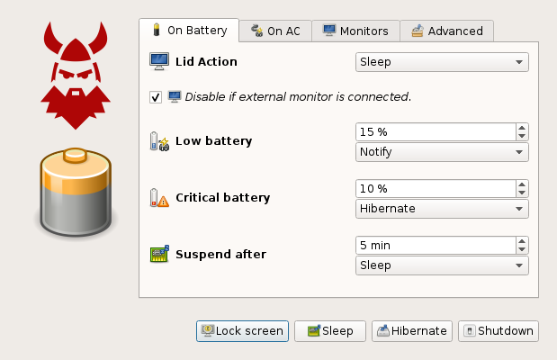

Power Dwarf is an power manager for Linux systems running alternative desktop environments/managers.

## Features

Some of the features included in Power Dwarf:

 * Implements the org.freedesktop.ScreenSaver daemon specification
 * Implements the org.freedesktop.PowerManagement daemon specification
 * Supports UPower
 * Supports monitor lid actions
 * Hibernate, suspend, shutdown on critical battery
 * Automatically suspend/hibernate
 * Monitor hot-plug support

## Compatibilty

Power Dwarf should work on any desktop environment/manager, system tray is recommended, but it's not required. The following desktops environments/managers are guaranteed to work:

 * Lumina
 * Fluxbox
 * Openbox

Lumina has the best integration, Power Dwarf will just work out-of-the-box. On Fluxbox you need to add ``powerdwarf &`` to the ``~/.fluxbox/startup`` file. On Openbox add ``powerdwarf &`` to the ``~/.config/openbox/autostart`` file. If your desktop environment/manager supports XDG then Power Dwarf should just work.

## Usage

Power Dwarf should be started during desktop startup, if your desktop environment/manager don't have any automatic function for startup applications just start ``powerdwarf`` manually.

## Requirements

Power Dwarf requires the following dependencies to build:

 * Qt 4/5 core/gui/dbus/xml
 * XSS (X11 Screen Saver extension client library)
 * RandR
 * Xinerama

And the following during run-time:

 * ConsoleKit (optional, needed for power off)
 * UPower
 * xscreensaver
 * xrandr

## Build

Power Dwarf is relativity easy to build, just:

```
mkdir build && cd build
qmake CONFIG+=release .. && make
sudo make install
```

For packaging use:

```
qmake CONFIG+=release PREFIX=/usr
make
make INSTALL_ROOT=/pkg/path install
```

 * The XDG destination can be customized with ``XDGDIR=``
 * The doc destination can be customized with ``DOCDIR=``
