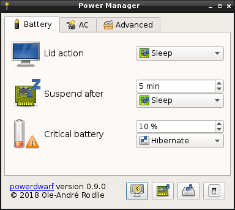

# powerdwarf

powerdwarf is a lightweight full featured power manager created for Slackware for use with alternative desktop environments and window managers, like Fluxbox, Blackbox, FVWM, WindowMaker, Openbox, Lumina and others.



## Features

 * Enables applications to inhibit the screen saver
 * Enables applications to inhibit suspend actions
 * Sleep/Hibernate/Lock screen on lid action
 * Inhibit lid action if external monitor(s) is connected
 * Automatically suspend (sleep/hibernate)
 * Hibernate/Shutdown on critical battery
 * Configuration GUI
 * Implements org.freedesktop.ScreenSaver
 * Implements org.freedesktop.PowerManagement
 * Supports XScreenSaver

## Usage

powerdwarf is a user session daemon and should be started during the X11 startup session. If your desktop environment or window manager supports XDG auto start then powerdwarf should automatically start, if not you will need to add powerdwarf to your startup file (check the documentation included with your desktop environment or window manager).

 * In Fluxbox add ``powerdwarf &`` to the ``~/.fluxbox/startup`` file
 * In Openbox add ``powerdwarf &`` to the ``~/.config/openbox/autostart`` file.

## Requirements

powerdwarf requires the following dependencies to work:

### Build dependencies

 * X11
 * Xss
 * Xrandr
 * QtDBus
 * QtXml
 * QtGui
 * QtCore

### Run-time dependencies

 * ConsoleKit (or logind)
 * UPower 0.9.23 (or higher, note that 0.99.x requires logind)
 * XScreenSaver
 * adwaita-icon-theme (or similar, must have battery status icons)

Tested on Slackware, Ubuntu and FreeBSD.

## Build

First make sure you have the required dependencies installed, then review the build options:

### Build options

 * **``PREFIX=</usr/local>``** : Install target.
 * **``XDGDIR=</etc/xdg>``** : Path to xdg autostart directory.
 * **``DOCDIR=<PREFIX/share/doc>``** : Path to the system documentation.
 * **``MANDIR=<PREFIX/share/man>``** : Path to the system manual.
 * **``UDEVDIR=</etc/udev>``** : Path to the udev directory (optional).
 * **``CONFIG+=release``** : Creates a release build
 * **``CONFIG+=no_doc_install``** : Do not install application documentation.
 * **``CONFIG+=no_man_install``** : Do not install application manual.
 * **``CONFIG+=no_desktop_install``** : Do not install the application desktop file.
 * **``CONFIG+=no_autostart_install``** : Do not install the XDG autostart desktop file.
 * **``CONFIG+=install_udev_rules``** : Install additional power related udev (backlight) rules

### Build application

```
mkdir build && cd build
qmake CONFIG+=release .. && make
```

Then just run ``app/powerdwarf`` or install with:

```
sudo make install
```

### Package application

```
qmake CONFIG+=release PREFIX=/usr
make
make INSTALL_ROOT=/pkg/path install
```
