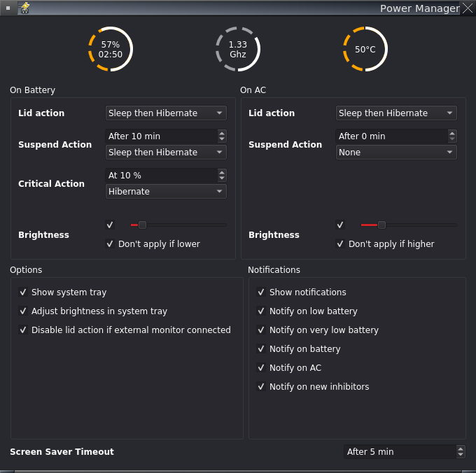

# powerkit

Desktop independent power manager for use with alternative X11 desktop environments and window managers on Linux.

 * Implements *``org.freedesktop.ScreenSaver``* service
 * Implements *``org.freedesktop.PowerManagement.Inhibit``* service
 * Automatic actions on lid, idle and low battery
   * Sleep
   * Hibernate
   * HybridSleep
   * Suspend then Hibernate
   * Shutdown
 * Screen saver support
 * Screen lid support
 * Screen locking support
 * Screen backlight support
 * Notification support (can use *``org.freedesktop.Notifications``* if available)

See [documentation](powerkit.md) (`man powerkit`) for more information.
